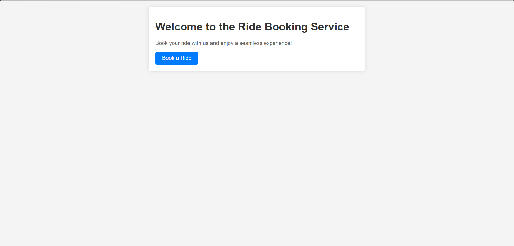
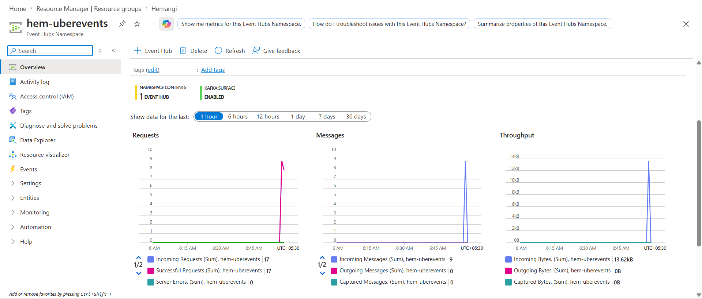
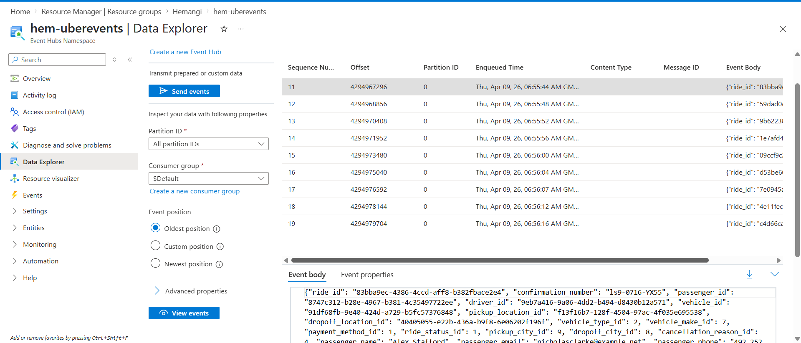
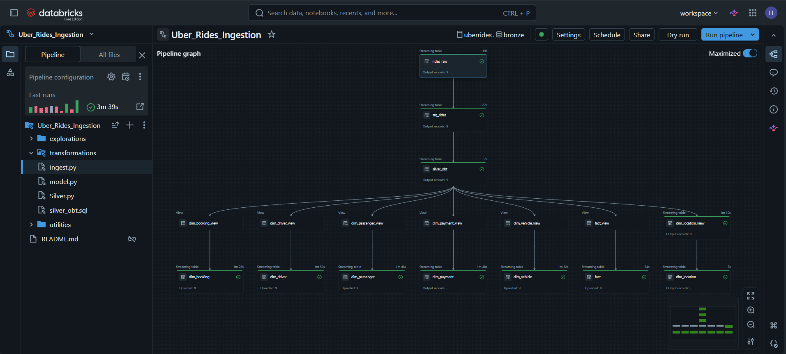

#  End-to-End Real-Time & Batch Data Engineering Pipeline (Uber Ride Booking)

##  Overview

This project demonstrates a **production-grade hybrid data engineering pipeline** simulating an Uber ride booking system. It supports both **real-time streaming ingestion** and **batch ingestion**, transforming raw data into **analytics-ready datasets** using modern data engineering practices.

---

##  Architecture


---

## ⚙️ Tech Stack

| Layer         | Technology                  |
| ------------- | --------------------------- |
| Frontend/API  | FastAPI                     |
| Streaming     | Azure Event Hub             |
| Processing    | Apache Spark (PySpark)      |
| Storage       | Azure Data Lake (ADLS Gen2) |
| Data Modeling | Star Schema                 |
| Batch Source  | GitHub (JSON datasets)      |
| Language      | Python, SQL                 |

---

##  Pipeline Flow

### 🌐 1. Web Application (Real-Time Data)

* FastAPI-based UI to simulate ride bookings
* Generates live ride events
* Sends data to Event Hub

 **Web UI**


---

###  2. Event Streaming (Azure Event Hub)

* Handles real-time data ingestion
* Ensures scalable and fault-tolerant streaming

 **Event Hub Monitoring**


📸 **Live Streaming Events**


---

###  3. Data Processing (Apache Spark)

* Processes streaming + batch data
* Creates a unified data pipeline
* Performs transformations, validation, enrichment

 **Pipeline Execution**


---

###  4. Medallion Architecture

* **Bronze** → Raw data ingestion
* **Silver** → Cleaned & transformed data
* **Gold** → Business-ready datasets

---

###  5. Data Modeling (Star Schema)

* Fact and Dimension tables for analytics
* Optimized for BI tools and reporting

📸 **Project Flow Representation**


---

##  Key Features

✔ Hybrid ingestion (Real-time + Batch)
✔ Event-driven architecture
✔ Medallion architecture implementation
✔ Scalable Spark processing
✔ Data quality handling (nulls, duplicates)
✔ Star schema for analytics

---

##  Project Structure

```bash
UberRideBooking_Project_Azure/
│
├── api.py
├── connection.py
├── data.py
│
├── Code_Files/
│   ├── ingest.py
│   ├── silver.py
│   ├── silver_obt.sql
│   ├── model.py
│
├── templates/
├── architecture.png
├── WebUI.png
├── EventHub.png
├── LiveEvent.png
├── SDP_Pipeline.png
├── Uber_Project.svg
├── README.md
└── .gitignore
```

---

##  How to Run

### 1️⃣ Clone Repository

```bash
git clone https://github.com/Hemangi-30/UberRideBooking_Project_Azure.git
cd UberRideBooking_Project_Azure
```

---

### 2️⃣ Install Dependencies

```bash
pip install -r requirements.txt
```

---

### 3️⃣ Setup Environment Variables

Create `.env` file:

```env
CONNECTION_STRING=your_eventhub_connection_string
```

---

### 4️⃣ Run Application

```bash
uvicorn api:app --reload
```

---

### 5️⃣ Trigger Pipeline

* Open `http://localhost:8000`
* Book rides → Data flows through pipeline 🚀

---

## 📈 Use Cases

* Real-time ride analytics
* Demand forecasting
* Revenue insights
* Driver performance tracking

---

## 🧠 Key Learnings

* Built hybrid ingestion pipeline
* Implemented real-time streaming using Azure
* Applied Spark for distributed processing
* Designed scalable data architecture
* Created analytics-ready data models

---

## 🚀 Future Improvements

* Add Airflow orchestration
* Integrate Power BI dashboards
* Implement monitoring & alerting
* CI/CD pipeline

---

## 👤 Author

**Hemangi-30**
